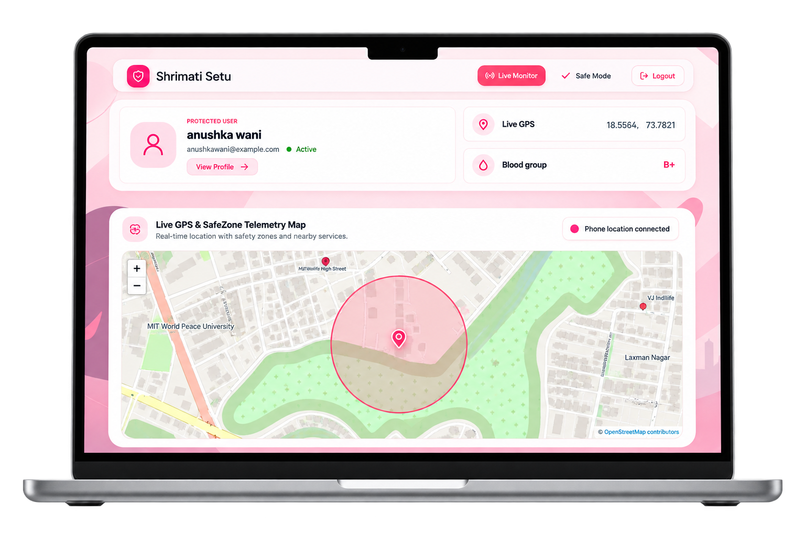
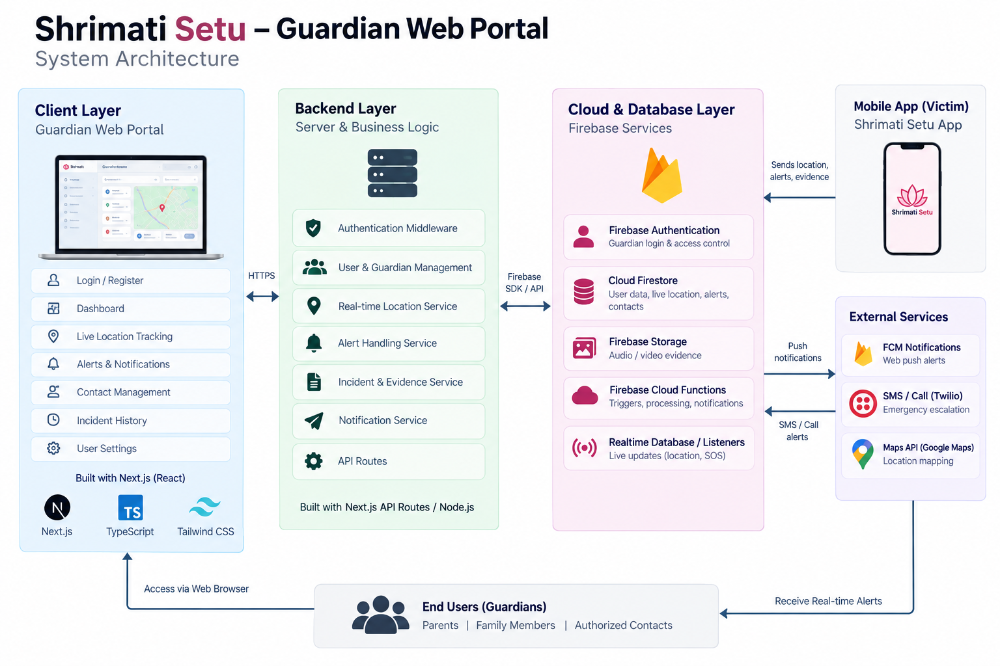
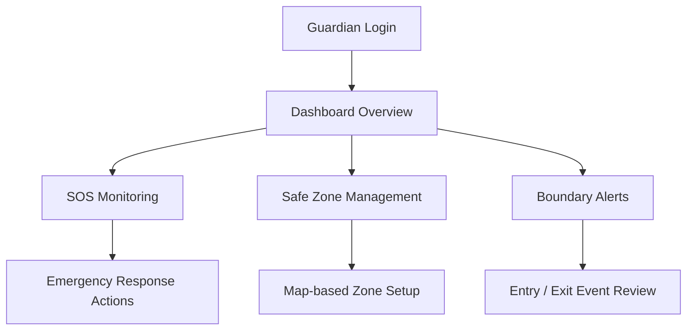

<div align="center">
  <h1>Shrimati Setu Guardian Dashboard</h1>
</div>

<p align="center">
  
  
  
  
</p>

<p align="center">
  
</p>

<div align="center">
  <h3>Built for guardians who cannot afford delays.</h3>
</div>

<p align="center">
  <b>Shrimati Setu Guardian Dashboard</b> is a real-time protection platform for guardians, designed to keep them aware, informed, and ready to respond when safety conditions change.
</p>

---

## Why this matters

Guardians need clarity, speed, and confidence when an emergency happens.

This dashboard gives them:

- instant awareness of SOS events
- live monitoring of location and status
- geofence-based safe zone protection
- boundary alerts for zone entry and exit
- evidence records to act with confidence

---

## Core features

- Guardian login and secure access
- live user profile and safety overview
- SOS event tracking and emergency response visibility
- safe zone creation, editing, and activation
- real-time boundary entry/exit alert monitoring
- recording and evidence-linked safety data

---

## Tech stack

- Flutter
- Firebase Authentication
- Cloud Firestore
- Firebase Storage
- Google Maps Flutter
- Dart + Material UI

---

## System architecture

<p align="center">
  
</p>

This architecture brings together the guardian-facing Flutter dashboard, Firebase services, real-time safety data, geofencing, and evidence storage into a single operational system. The flow is built around security, speed, and reliable monitoring for rapid guardian response.

---

## Gap analysis

| Category | Existing market solutions | Shrimati Setu Guardian Dashboard |
| --- | --- | --- |
| Real-time safety response | Often fragmented and delayed | Built for instant guardian visibility and reaction |
| SOS handling | Basic alerts with poor context | Clear emergency event monitoring with structured data |
| Safe zone control | Generic geofence tools | Guardian-specific safe zone management and boundary logic |
| Evidence access | Limited records or weak traceability | Recording and activity-linked evidence support |
| User experience | Traditional dashboards, slow and cluttered | Premium dark-tech command center interface |
| Trust & operational clarity | Hard to act on without context | Centralized monitoring for fast, informed decisions |

---

## App flow



---

## Quick start

### 1. Install dependencies

```bash
flutter pub get
```

### 2. Set up Firebase

- create a Firebase project
- enable Authentication
- enable Firestore
- enable Storage
- configure `firebase_options.dart`

### 3. Run the project

```bash
flutter run
```

For web:

```bash
flutter run -d chrome
```

### 4. Build for production

```bash
flutter build web
```

---

## Status

This project is positioned as a guard-focused safety monitoring dashboard for the Shrimati Setu ecosystem, with emphasis on speed, trust, and operational clarity.

---

## Final intent

The goal is simple: turn safety data into a fast, reliable command center that helps guardians act before situations become critical.

